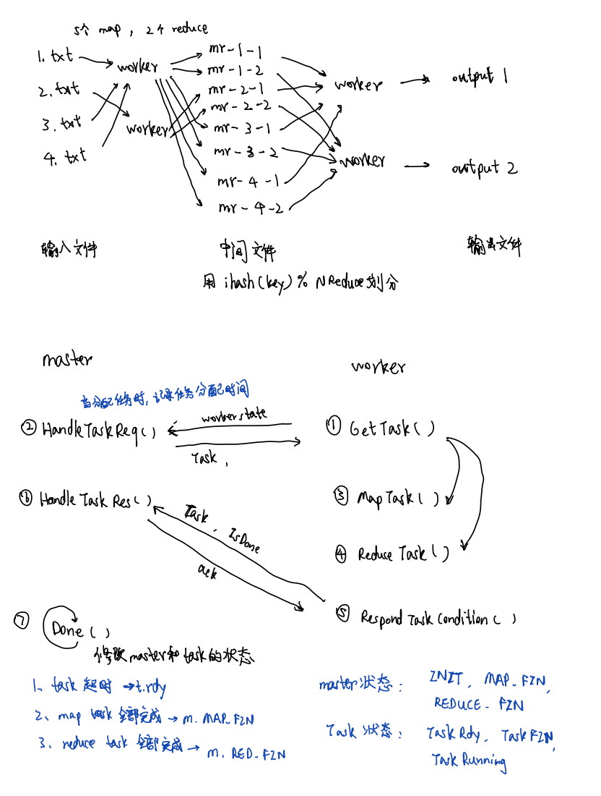

## 6.824笔记

按照课程要求，这里就不公开代码了。
放一篇实验笔记记录一下lab中的一些关键点和踩过的坑^^。
补充了一份pdf，上面有当时的实现思路。

## Lab1

- map-reduce 流程
1. split: 把input files分割为m个子片段

2. fork: 创建1个master和多个worker，整个计算过程会执行m个map task和r个reduce task，master用于调度workers

3. map: 当worker被分配到map task，它会去读取指定的片段，调用mapf()处理原生数据，生成k-v中间数据，通过hash把中间数据归类到r个文件，再写入disk

4. reduce: 当worker被分配到reduce任务时，它会通过rpc读取中间文件，由于这些中间文件是无序的的（指的是key与key之间没有排序），当一个reduce task读完它需要处理的多个reduce文件后，需要统一对key排序。排序后对每一个key调用reducef()聚合，最后把结果输出到对应分区的output file。

5. 错误处理: lab中的容错机制比论文上的要简单很多，当worker失效（指的是master发现这个任务超时了依然没有执行完成），master就会把对应task状态改为ready，重新把task分配给worker。

## Lab2A

这个lab要我们实现最基础的选举RequestVote和心跳（不包含日志的AE）机制。

节点只要接收到有效的RPC调用，就要重置timer（记录最近一次收到RPC的时间，如果和(Now – last beat)> timeout就算超时），无效的消息直接无视，否则会出现超时no leader。

需要提几点，RPC过程中不能加锁，否则会可能出现死锁现象；无论是leader还是follower每次接收到消息，都需要优先对消息的Term作判断，防止由于网络延迟等问题，导致过期的消息产生不良影响，或者过期leader没有及时发现自己过期，错误写入。

每当收到更高term的响应（当然也是有效的RPC），也要记录最近一次收到RPC的时间(相当于重置timer)，别忘了升term的同时把voteFor置为-1。

- Term升高得太快：
sendAE刚开始设计用sync.WaitGroup实现：发送AE前add(1)，接收到返回done()，每组AE发送直接通过wait()做同步（WaitGroup），从而达到每一轮的AE都完成后再开始下一轮AE。但是会遇到一种情况，就是某些机器可能在接收到RPC途中会宕机或网络出现异常，不会返回reply，导致很长时间无法发送下一轮的AE，从而触发follower超时，升term。这个bug很长一段时间没有发现，直到开始做2B的时候才发现。

第一个方法是我们可以通过pingLoop()去控制发送AE的频率。

更好的方法是用sync.NewCond(&rf.mu)，wait()和boardcast()来控制，通过另一个线程在超时时唤醒主线程来避免主线程死锁，这样就不用一大堆丑陋的sleep()了。

## Lab2B

这个lab要我们实现日志复制机制。

在刚开始读Raft论文的时候没有正确理解应用到状态机是什么意思，以为是需要在Raft库中重新设计一个状态机的数据结构。最后发现实际上应用过程就是更新commitIndex。commitIndex表示可以应用进状态机的数据，lastApplied表示实际已经应用到k-v库（论文中的状态机）的数据，状态机我的理解是k-v数据库的抽象概念。

我们大致梳理一下日志同步的流程：
1. 首先集群的leader收到来自client的command interface{}，即新log entry
2. 然后leader会直接把该entry直接追加到本地日志中
3. AE线程会通知follower追加这条新日志
4. 当有过半follower追加成功后，leader便提交日志到状态机中（由apply线程完成）

在Lab2B，我们不需要改动RequestVote()（前提是这个部分的实现没有bug），通过实现在AE中附带日志项，使得集群能得到完全一致的日志状态。

根据论文描述，我们可以通过新的变量matchIndex[], nextIndex[], prevLogIndex[], prevLogTerm[]来完成日志同步。前两个变量作用于leader，matchIndex记录leader和每一个follower当前匹配到的日志项的索引值，nextIndex记录leader准备要发送给每一个follower的日志项的索引值。prevLogIndex和prevLogTerm作用于leader向follower发送AE时，试探当前的follower日志与leader日志的同步位置，发现不同步则需要清除不同步的日志。当candidate成为leader后，matchIndex会初始化为0，而nextIndex会初始化为len(logs)。

- 为什么要把matchIndex初始化为0而不是len(logs)？
1. 我的理解是，当重新发生了选主，意味着集群出现异常，重置为0可以确保follower所有的不一致或者缺失的日志都可以被修复。prevLogIndex和prevLogTerm取nextIndex[i]-1的日志项信息，如果与follower的日志不一致则向前回滚。
2. 当follower接收到日志不匹配是由两种情况引起的，第一种是由于follower还有很多条日志没有接收到，没有出现和leader日志冲突的现象；第二种是由于leader出现宕机等意外，导致follower和当前最新leader在同一个logIndex下有不同日志，这种情况需要follower清除掉有冲突的日志项。
3. 为了提高同步效率，在这个实现中，leader发送的每一个AE包含多个entries，而不是每次只发送nextIndex这一条entry。

- 这里再记录一下我在实现中遇到的两个问题。
1. 第一个问题是，性能问题。当leader发现follower没有匹配发送的日志项，需要向前试探。如果我们每次只试探前一条，会无法通过测试TestCount2B，因此需要加快匹配的速度。这里我采用了木鸟大佬的解决方法，每次试探错误就往前跳过一个term，成功通过测试。
2. 第二个问题是，日志项索引的问题。论文要求的第一个index是1，但是我的实现中第一个index是0，刚开始没发现这个问题，导致测试脚本一直报日志项不匹配错误。我这里的补救措施是在启动服务器时先写一条空日志，用于填充index=0的位置。

## Lab2C

这个lab要求我们完成persist()和readPersist()两个函数，并且在合理的位置调用它们，实现持久化。

这个实验感觉是前3个lab中实现起来最简单的一个，两个函数的代码示例非常清晰明了。需要持久化的参数在论文也明确写出，分别是：currentTerm, voteFor和logs。我们主要的工作是思考在什么地方持久化，以保证数据不会丢失。

简单来说，每次这三个变量发生变更时，我们都需要调用persist()，readPersist()则在启动程序时调用一次即可。

## Lab3

本来以为实现了Raft库以后，为Raft库实现client以及存储k-v的server应该比较简单。但实际上也遇到了不少的问题。

## Lab3A

这个实验要求为Lab2实现的Raft库设计并实现能处理节点容错的客户端和KVDB。测试用例中有多个client，这些client会并发地发送command并且会有模拟网络故障的各种情景，我们设计的服务端需要解决消息乱序，消息重发等问题。

- 这个实验共有4个测试用例：
1. 只有一个client，满足command执行成功，5个server的日志一致。
2. 5个client，满足command执行成功，5个server的日志一致。
3. server会出现网络分区，原leader在少数分区的情况下，要求满足正确执行。
4. 多个client并发发送对应相同的key的command，会出现超时重试的场景，满足线性一致性
5. 在出现网络分区，消息超时重试的情况下，依然保持线性一致性。

这个实验和lab2最大的区别是Lab2基本上不需要自己设计，全部api，RPC调用过程，同步过程在论文中都有很详细的说明。而lab3需要我们根据具体情况，自己设计满足要求的处理过程及对应的api。

下面说说我在实现过程中碰到的一些重难点：

1. 第一个是如何实现消息幂等性，即处理重复的请求。由于Raft并不会校验log中的operation是否是来自重复的请求的，因此需要在KVserver部分解决这个问题。client发送的每一条请求都会带有自己的编号cid以及单调递增的seq号，这两个参数都会被记录在operation中发送到Raft库处理。KVserver通过一个map<cid,seq>，记录每个cid当前最新的seq。每当KVserver接收到一条新的日志（applyCh <- msg），如果发现日志中的seq小于map中的最新seq，则说明收到的消息是重复的，不写入到KVDB中。
- 补充: 
这里同样也可以优化一下，原来的实现在应用kvDB时才校验seq，其实我们应该在写入Raft前就校验seq。
在当时的client实现中，一条请求会在一开始就确定好seq number，即便后面不断发给不同的Raft server，seq也不变。因为kvserver一定要经过start(command)以后，才能知道当前server是不是leader。
如果在这里校验幂等性，相同的消息就不能走两次start(command)，会出现这样的一种情况：如果第一次这个server不是leader，在重试的时候，这个server变成leader。这样数据就写入失败了。
我们只要让client在changeLeader时升seq，其实就可以在写入Raft前校验seq。

2. 第二个问题是client需要发送请求到leader对应的KVserver，才能正确读写KVDB，因此client需要及时发现与自己连接的是否是正确的leader。除了校验Start()返回值isLeader外，还有一种容易被忽略的情况：当出现网络分区，过期的leader可能仍然把自己当做leader发送AE，这种情况下，client同样也需要更改leader进行消息重发。这个错误检测需要校验我们写入log的操作是否被正确写入。KVserver通过一个map<commandIndex, operation>，保存被提交到状态机的log的Index和对应的operation。在KVsever执行GET/PUT方法时，如果发现计划写入到Index=x的operation并没有写入到Index=x的log中，则说明操作异常，需要更新leader并重试。
- 补充: 
isOpCorrect(command, op)这里是一个优化点。上述方案通过对比相同的index的op是否相同来判断operation是否真正被写入到状态机中，但是operation太大了。虽然commandIndex2Op不用持久化，但是我们通过index和term就可以校验是否是同一个operation（index+term具备唯一性，如果操作异常term必然不相同）。

- 最后再提几点实现过程中踩到的坑：
1. 第一个是由于我的Raft会先写入一条空command，而这条command不是Op类型，因此KVserver在得到msg需要判断command能否cast为Op类型。
2. client发送的请求主要分为GET和PUT两类，为了实现简便，KVserver接收到这两类请求都会封装为Op并发送到Raft中进行同步，因此Raft日志中即记录了写日志也记录了读日志。
3. 在KVserver的实现中，一些异步操作由于本人目前Go掌握水平太辣鸡采用了简单暴力的sleep()完成，用管道实现性能会更好（这也许也是导致TestSnapshotSize3B性能测试没有通过的原因之一）。

## Lab3B
这个实验要求我们通过Snapshot机制为Raft实现日志压缩。如果不进行日志压缩，我们的logs和map<commandIndex, operation>会越来越长，这会不但会浪费大量的内存空间，而且当节点崩溃后，恢复长日志也会耗费很多时间和资源，因此我们需要压缩日志，让logs保持在一定长度范围内。每一个节点都可以独立产生快照进行日志压缩。

- lab中的所有持久化操作都需要由Raft库参与完成，因为Snapshot可能需要复制到follower。
- Snapshot组成：RaftState + kvDB + cid2seq
- Raft库不知道kvDB和cid2seq是什么，需要KVServer序列化这两个数据结构后发送给Raft库。
- RaftState：currentTerm + voteFor + log[] + lastIncludedIndex + lastIncludedTerm

- 日志压缩所需要的API在论文中也有说明，这里先简单介绍处理流程：
1. 每一个KVserver节点在接收并处理状态机更新信息msg后，检查Raft的日志长度；
2. 如果长度接近上限，则保存一份KVDB数据并通知Raft完成持久化（KVDB, map<cid,seq>和状态快照）。状态快照除了lab2持久化的三个参数外还需要新增lastIncludedIndex和lastIncludedTerm，用于记录快照中最后一条日志的逻辑index和term；
3. leader发送AE时，如果发现nextIndex小于lastIncludedIndex，则发送InstallSnapshot而不是AE；
4. follower接收到快照，则根据不同情况更新自己的快照，日志，commitIndex, lastApplied并重置KVDB和map<cid,seq>（和leader保持一致）

- 实现过程中踩的坑：
1. 需要提一点的就是，代码实现里面KVserver通知Raft生成新快照这一过程有可能会出现2号快照比1号快照先拿到锁，因此需要判断commandIndex是否大于lastIncludedIndex。
2. 这个实验由于需要大量改动lab2代码，多处index需要加减快照位移量，很容易出错.

- 出现的问题：
1. TestSnapshotSize3B非常慢，测试用例无法通过，超时约50%。
- 这个测试用例有一个特点，就是每次发送指令后，会等到检查到指令被写入再发送下一条。由于测试用例对性能有要求，并且这个特点放大了pingLoop()间隔太长的问题。优化的方式是，当leader接收到新的指令，主线程会立刻发送一次AE，而不是被动等到pingLoop()线程发送。
- 这样做后，通过观察日志就能明显看出处理速度大大提升，这样又引出了另一个bug，log不一致问题，改进方法也比较朴实无华，就只是增大了AE()的锁粒度，刚开始没有为append(logs)加锁，只着重于对状态变更和持久化加锁，append(logs)加锁后，问题解决。

## Lab4A
实验4要求我们为kv系统实现分片机制，由于raft读写请求都需要leader处理，所以leader节点的读写处理压力非常大，通过分片我们能够把读写请求均匀地分散在不同Raft组中，从而提高kv存储系统性能。

4A要求实现shard-master，shard-master是kv系统的configuration manager，管理着分片到replica groups的映射关系，当有新的replica groups被添加或者被移除，shard-master都需要创建一个新的Config，并且这个新的Config要尽可能均匀地把shard分配到所有replica groups中，还要尽可能少地移动shard。其中的任何一个replica group都能被加入，离开，再次加入。其中一个shard只能被一个replica group管理，一个replica group可以管理多个shard.

在4A中，我们需要实现4个RPC接口：Join(), Leave(), Move(), Query()。通过这4个接口来实现replica groups配置的改动。

与Lab3类似，这里我们实现的server需要解决消息乱序，消息重发等问题。保证client请求是幂等的，即过滤重复RPC。

这个shard-master同样也是一个raft集群，因此我们还是通过类似lab3的处理逻辑，把Join, Move, Leave, Query作为日志写入到Raft中，再apply。

这个实验的难点在于如何保证shard被尽可能均匀分配，在replica group发生改动后，如何尽可能移动最少的shard即可做到shard被均匀分配。

这里我采用了直接排序的方式实现shard移动，Join：当有新的replica group加入到系统中，先计算平均值，即平均每个RG所管理的shard数量，通过最简单粗暴的方式遍历排序，把当前持有shard最多的RG的shard移动到新加入的RG。（虽然测试用例能通过，但肯定没有用堆的方式实现性能好）。Leave：处理逻辑与Join类似，先把要移除的RG对应的shard收集好，然后又是暴力地一遍又一遍遍历排序，每次把一个shard加入到当前持有最少分片的RG中。Move和Query处理逻辑比较简单，就不做描述了。

## Lab4B
来到了最后一个lab任务，4B要求我们实现shardkv，即通过运用4A实现的shard-master来建立一个分片的容错kv存储系统（a sharded fault-tolerant key/value storage system）。其中每一个shardkv都属于一个RG。每一个RG也类似lab3，提供Get, Append, Put来操作分片内的kv。这些RG共同组成完整的kv存储系统，每一个RG需要管理的shard由shard-master分配和调度。当shard分配发生变化时，RP需要把不属于自己的shard转移给新的RG，同时这一过程对client透明，client不能看到数据不一致的响应。

这个实验的第一个难点是设计系统对client请求的处理流程。每次当client发出一个Get/Append/Put请求后，client会根据响应结果判断是否需要从shard-master处刷新config，获取当前的配置信息来判断key属于哪一个RG。

第二个问题是，可能会出现这样的情况：当client发送写入请求时，shard A属于RG1，但是由于请求的写入Raft日志和应用到状态机，是异步过程，有可能中途会发生shard移动，导致shard A属于RG2，写入失败。因此在server的PutAppend() 中，在apply到状态机后，需要校验此时的写入的shard是否仍然被当前RG所管理，如果不是，则要返回ErrWrongGroup。
最后一个难点是如何在接收到configuration改动日志后实现动态分片数据迁移。为了简便，我这里所有的对RG的操作命令都会以写入到Raft日志，应用状态机的方式，保证RG中所有实例的操作的线性一致性。生成快照，应用新Config，拉取新的Shard data会和Put/Get操作一样写入Raft日志中。快照和持久化的实现基本与Lab3一致。这里着重讲讲分片数据迁移。

- 分片数据迁移的数据结构：
shards map[int]void                                 
// 当前正在提供服务的分片集合

outShardsKv map[int]map[int]map[string]string       
// configNum-(shard-(key,value)), 存有不再负责的分片数据，例如config2不再负责的分片4数据存储在outShardKv[1][4]中

missingShardsKv map[int]int                         
// 存储当前缺少的shard，当missingShardKv不为空，表示当前config还有数据需要从其他集群中拉取, shard-configNum

kvDBs map[int]map[string]string                     
// k: shard, v:(map <k, v>)

Kv-server会通过updateConfigLoop拉取新的Config，一旦有新Config就写入Raft，更新shard-info，更新shard-info的主要目的是把不再属于这个RG的shard存入outShardsKv，把缺失的shard存入missingShardsKv。

Kv-server会通过pullShardDataLoop遍历missingShardsKv，并从其他RG拉取Shardkv。把拉取到的Data以applyingMigrationData的形式写入Raft日志进行日志迁移，即把新的分片kv写入到RG的kvDBs中。注意，cid2seq也需要同时拉取，拉取后一旦发现对方主机的seq更大，需要更新seq（因为cid的自增序列号不会区分服务主机，这样可以防止消息重传导致数据错误修改）。

- 当时实现过程中遇到了数不清的坑，影响比较深的有以下几个：
涉及到RPC的地方加锁一定要慎重，一不注意很可能会出现死锁情况。在配置改变期间，一对RG可能会进行双向分片移动，这很可能会导致死锁。
在获取新configuration时，可能会出现这样的情况：当前的configuration的迁入分片数据没有拉取完就接收到了下一个configuration。如果此时我们直接刷新configuration会导致有数据没有来得及迁入就被终止了。因此当missingShardsKv不为空时，不能刷新configuration。

## 附加题Garbage Collection
分片迁移后，本来shard A保存在RG1中，后来由RG2保存。我们既要保证shard A数据能被RG2拉取，但又不能让作废的分片数据一直残留在RG1中。测试用例要求我们把持久化数据大小控制在117000byte，但是目前实现的GC方案的持久化数据大小为454946byte，远不符合用例要求。更加棘手的时，我把missingShardsKv和outShardsKv删掉后，依然不满足要求，这意味着我的数据结构设计得有问题，当时完全没有从这方面去考虑。目前还没有想到解决方案。

- 问题1
在hand-off期间，client发起Get，客户端此时拿到新的config，但是数据还没有完成迁移。或者拿到旧的config，向正在进行迁移的旧shard请求数据，该如何处理？旧的group认为数据已经发出去了，新的group却失败了，应该怎么办？
在本实现方案中，我为每个shard都创建了一个HashMap，虽然很可能这是导致持久化日志过大的原因，但好处是可以根据是否有该shard对应的HashMap来判断当前分片是否属于这个集群，同时数据迁移的时候，也可以单独迁移整个shard的HashMap。
当客户端拿到新config，但是新group仍未拿到新config时（未创建shard的HashMap），client会认为访问错误的group，进行重试。当新group拿到新config时，client会得到数据不存在的返回结果，因此这种情况，即导致旧的group认为数据已经发出去了，新的group却失败了，实现方案没有对这种情况实现处理机制，只能由用户重新发起Get()请求。
由于当group接收到新的config后，第一时间会把不属于自己shard移出kvDBs，所以当client拿到旧的config，访问旧group时，会得到wrong group响应，然后重试。

- 问题2
可能会出现旧的group和master断开连接，依然在服务这个shard，如何处理？
断开连接的情况有两种，第一种是group内的原master发生网络分区，依然认为自己是master。在lab4中，client没有记录当前哪台主机是master，所以即便是已经raft集群已经选出了新的mater，client依然是有可能连接到旧master的。但是当这种情况发生，根据raft机制，必然会返回Put/Get失败，然后client会重试，找到新的master，从而完成写入请求。同时新的master也会与kv-master通信，从而拿到最新的config，即group内发生网络分区，不会影响到config的正常更新。
第二种是整个group与master断连。这会导致原来shard-bucket中的数据丢失，lab中并没有实现对这种情况的容错机制，容错基于单个server发生故障。不过group中的不同节点通常会跨机房/数据中心，问题不大。
